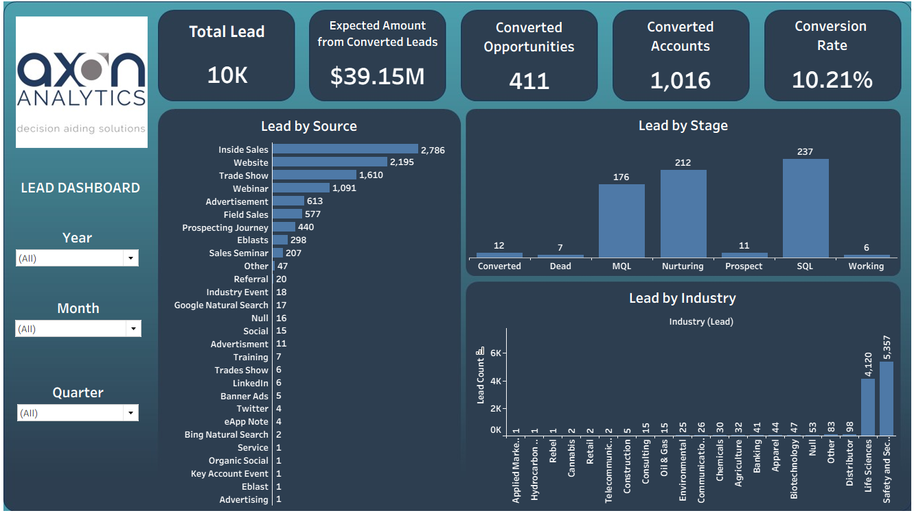
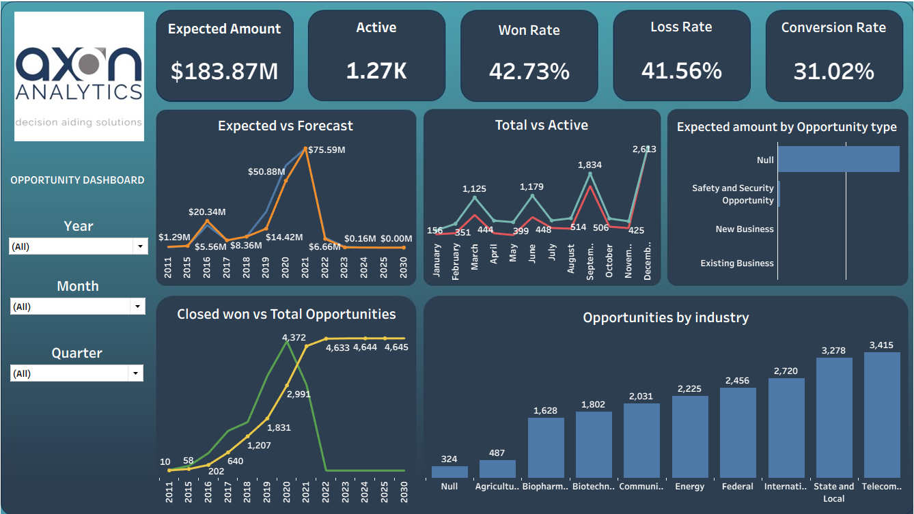

# 📊 CRM Analytics Dashboard
Lead and opportunity analysis of a CRM dataset using SQL, Excel, Power BI, and Tableau with interactive dashboards and actionable business insights.

## 📌 Project Overview
- An end-to-end CRM analytics project focused on analyzing sales funnel performance.
- Performed data cleaning, transformation, analysis, and visualization.
- Tools used: Excel, Power BI, Tableau, MySQL (SQL).
- Focused on analyzing Leads, Opportunities, Conversions, Expected Revenue, and Forecasted Revenue.

## 🧰 Tools & Technologies
- SQL (MySQL) → Query-based analysis, joins, aggregations & data validation
- Power BI → Data modeling, DAX measures & interactive dashboards
- Excel → Data cleaning & preprocessing
- Tableau → Visual analytics & dashboard storytelling

## 📂 Dataset Description
The dataset follows a relational CRM data model:
- User – Sales representatives and system users
- Lead – Lead source, status, and conversion details
- Account – Customer and account-level information
- Opportunity Table – Opportunity value, stage, and close status
- Opportunity Product – Product-wise deal and revenue breakdown

## 📊 Dashboards & Analysis
### Lead Dashboard
- Lead by industry
- Lead by source
- Lead by stage

### Opportunity Dashboard
- Total Opportunities & Active Opportunities
- Expected vs Forecasted revenue
- Closed Won vs Total Opportunities
- Opportunities by industries
- Expected amount by opportunity type

## 🖥️ KPI's Used
- Total Leads
- Converted opportunities
- Converted accounts
- Conversion Rate
- Expected amount by converted leads
- Expected Amount
- Active
- Win Rate
- Loss Rate
- Conversion Rate

## 🧠 Key Insights
- Identified high-performing lead sources contributing to higher conversion rates.
- Analyzed sales funnel stages to identify opportunity bottlenecks.
- Evaluated pipeline accuracy using expected vs forecasted revenue.
- Highlighted trends in closed-won and closed-lost opportunities over time.
- Provided insights to improve sales efficiency and pipeline management.

## 📊 Dashboard Preview

### Lead Dashboard

### Opportunity Dashboard

